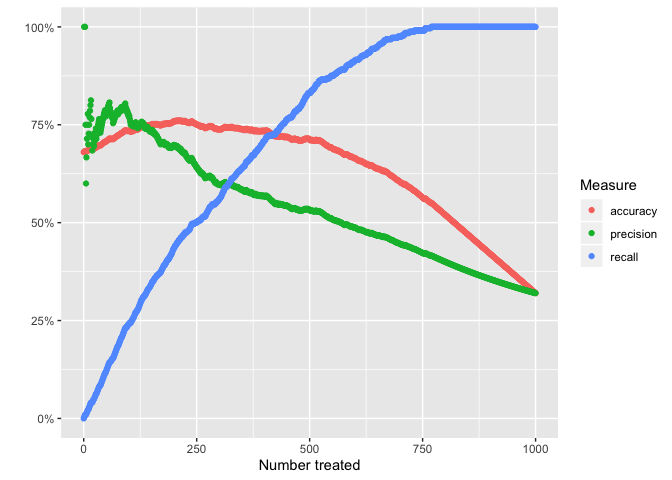
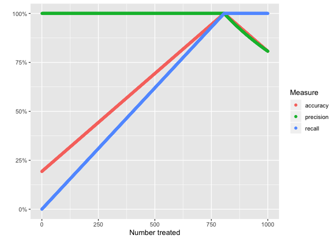

Visualizing model performance
================

let’s generate data. all we need to make these plot is the outcome and a
proba score from a model. you might imagine the outcome is getting the
flu this season.

``` r
library(tidyverse)
```

    ## ── Attaching packages ────────────────────────────────────────────────────────────────── tidyverse 1.2.1 ──

    ## ✔ ggplot2 3.2.0     ✔ purrr   0.3.2
    ## ✔ tibble  2.1.3     ✔ dplyr   0.8.3
    ## ✔ tidyr   0.8.3     ✔ stringr 1.4.0
    ## ✔ readr   1.3.1     ✔ forcats 0.4.0

    ## ── Conflicts ───────────────────────────────────────────────────────────────────── tidyverse_conflicts() ──
    ## ✖ dplyr::filter() masks stats::filter()
    ## ✖ dplyr::lag()    masks stats::lag()

``` r
data <- 
    tibble(proba = runif(1000)) %>% 
    mutate(outcome = as.integer(proba > runif(1000) + 0.2)) %>% 
    select(outcome, proba)
```

write a few functions

``` r
get_accuracy_top_n <- function(n, data){
    data %>% 
        arrange(desc(proba)) %>% 
        mutate(pred = c(rep(1, n), rep(0, nrow(data) - n))) %>% 
        summarize(acc = mean(outcome == pred)) %>% 
        pull(acc)
}
get_precision_top_n <- function(n, data){
    data %>% 
        arrange(desc(proba)) %>% 
        mutate(pred = c(rep(1, n), rep(0, nrow(data) - n))) %>%  
        filter(pred == 1) %>% 
        summarize(precision = mean(outcome == pred)) %>% 
        pull(precision)
}
get_recall_top_n <- function(n, data){
    data %>% 
        arrange(desc(proba)) %>% 
        mutate(pred = c(rep(1, n), rep(0, nrow(data) - n))) %>%  
        filter(outcome == 1) %>% 
        summarize(recall = mean(outcome == pred)) %>% 
        pull(recall)
}
```

use those functions to calculate

``` r
output_for_top_n <- 
    tibble(n = 0:nrow(data)) %>% 
    mutate(
        accuracy = n %>% map_dbl(get_accuracy_top_n, data),
        precision = n %>% map_dbl(get_precision_top_n, data),
        recall = n %>% map_dbl(get_recall_top_n, data)
    )
```

graph

``` r
output_for_top_n %>% 
    gather(Measure, value, -n) %>% 
    ggplot(aes(x = n, y = value, color = Measure)) +
    geom_point() +
    scale_y_continuous(labels = scales::percent) +
    labs(
        x = "Number treated",
        y = ""
    )
```

    ## Warning: Removed 1 rows containing missing values (geom_point).

<!-- -->

what would this look like if our model was perfect?

``` r
data_perfect <- 
    tibble(proba = runif(1000)) %>% 
    mutate(outcome = as.integer(proba > 0.2)) %>% 
    select(outcome, proba)
tibble(n = 0:nrow(data_perfect)) %>% 
    mutate(
        accuracy = n %>% map_dbl(get_accuracy_top_n, data_perfect),
        precision = n %>% map_dbl(get_precision_top_n, data_perfect),
        recall = n %>% map_dbl(get_recall_top_n, data_perfect)
    ) %>% 
    gather(Measure, value, -n) %>% 
    ggplot(aes(x = n, y = value, color = Measure)) +
    geom_point() +
    scale_y_continuous(labels = scales::percent) +
    labs(
        x = "Number treated",
        y = ""
    )
```

    ## Warning: Removed 1 rows containing missing values (geom_point).

<!-- -->
